# App components

The app is composed of different react components. To have a more extensive view of most of them visit the [Climate Watch Components package](https://climatewatch-vizzuality.github.io/climate-watch-components/). Many components are imported from this package and others come from the climate-watch codebase. Some other example of components:

- Topbar

    

- Nav

  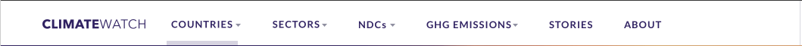
- Countries

  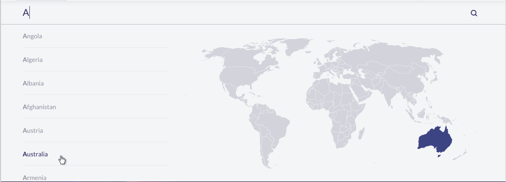

- Searchable list

  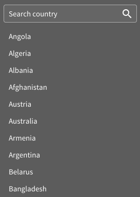

- Search

  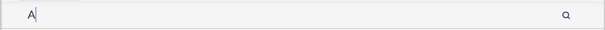

- List

  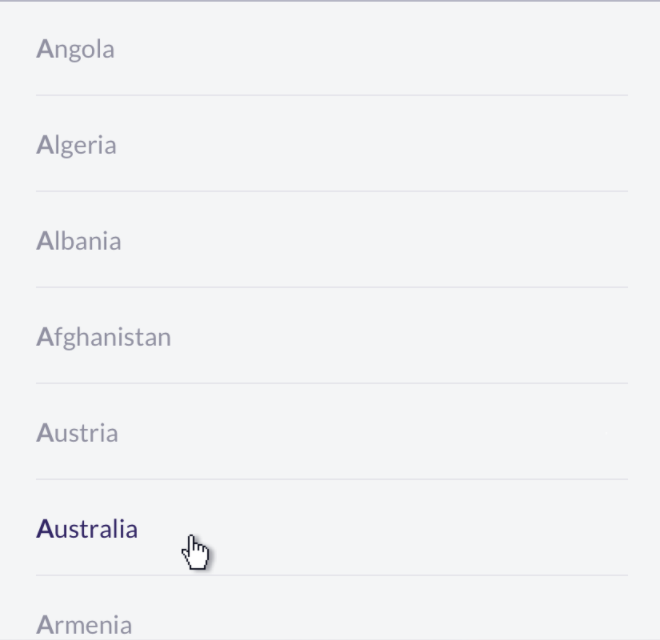

- Map (clickable and hoverable)

  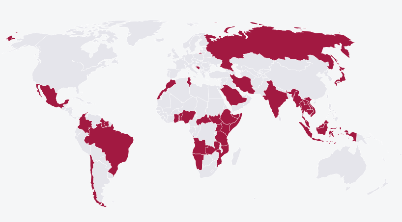

- Tools nav (my cw and download)

  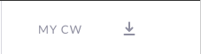

- Header

  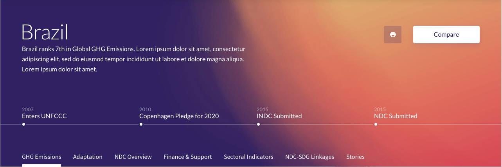

- Intro (title + description)

  

- Timeline

  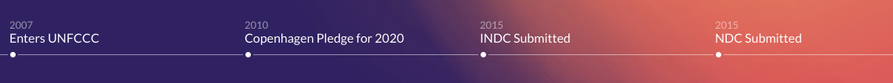

- Buttons

  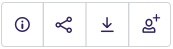

- Text

  

- Icon

  

- [Dropdown](https://jedwatson.github.io/react-select/)

  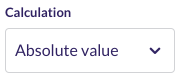

- [Sticky](https://github.com/captivationsoftware/react-sticky)
  - Anchor nav

      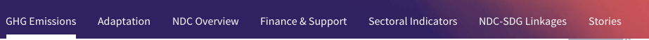

- Legend

  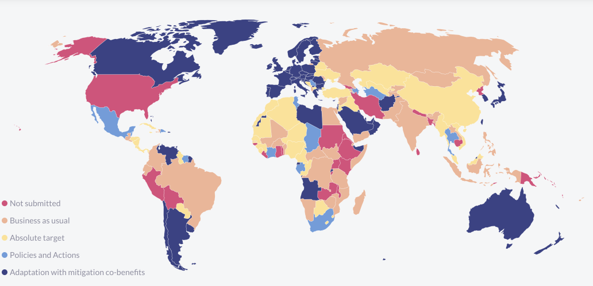

- [Accordion](https://github.com/nkbt/react-collapse)

  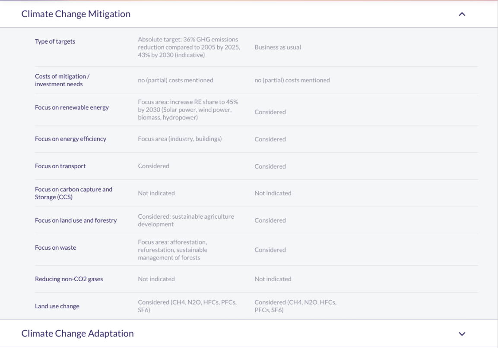

- TileGrid

  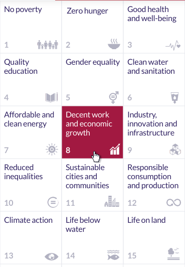

- SDG list

  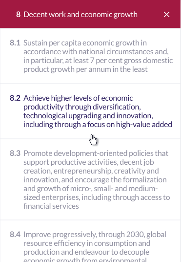

- Card

  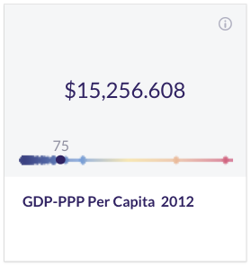

- [Table](https://github.com/bvaughn/react-virtualized)

  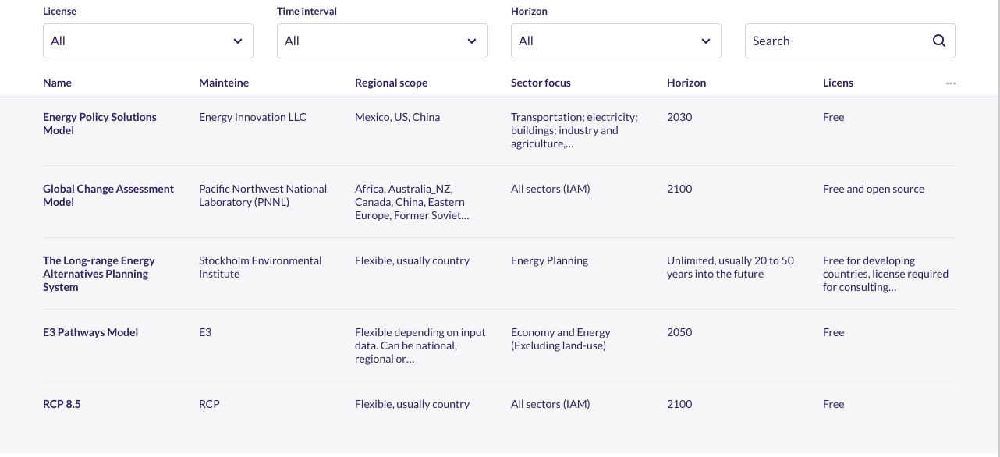