# App component

- Topbar

    

- Nav

    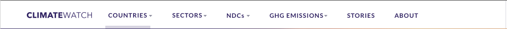
    - Countries

        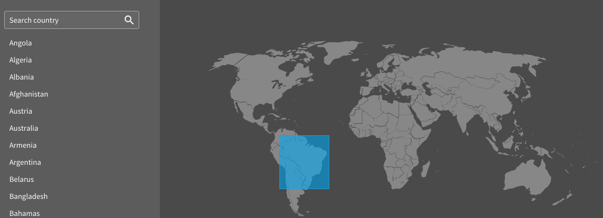

        - Searchable list

            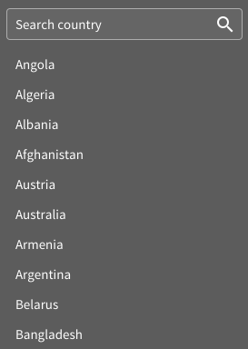

            - Search

                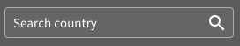

            - List

                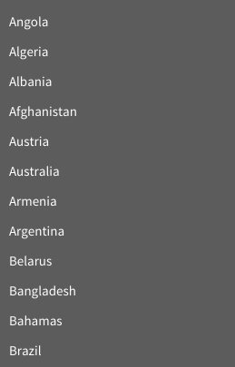

        - Map (clickable and hoverable)

            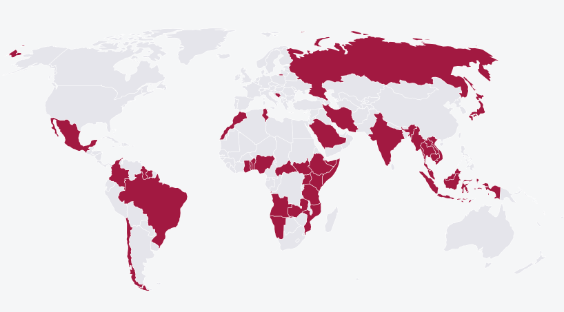

    - Tools nav (my cw and download)

        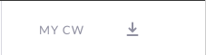

- Header

    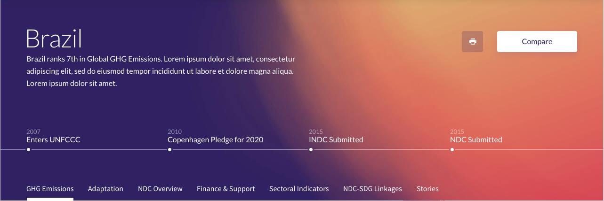

    - Intro (title + description)

        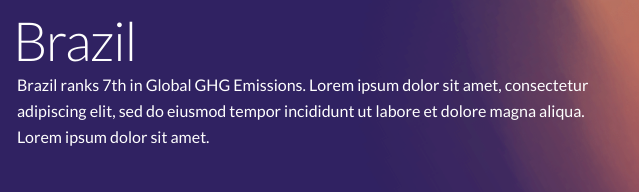

    - Timeline

        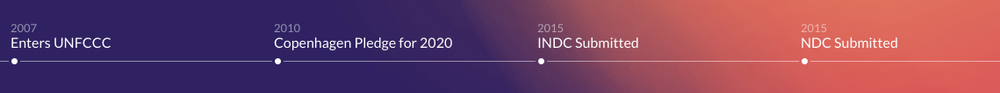

- Buttons

    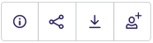

    - Text

        

    - Icon

        

- [Dropdown](https://jedwatson.github.io/react-select/)

    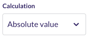

- [Sticky](https://github.com/captivationsoftware/react-sticky)
    - Anchor nav

        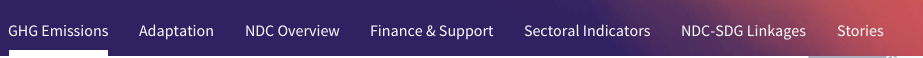

- Legend

    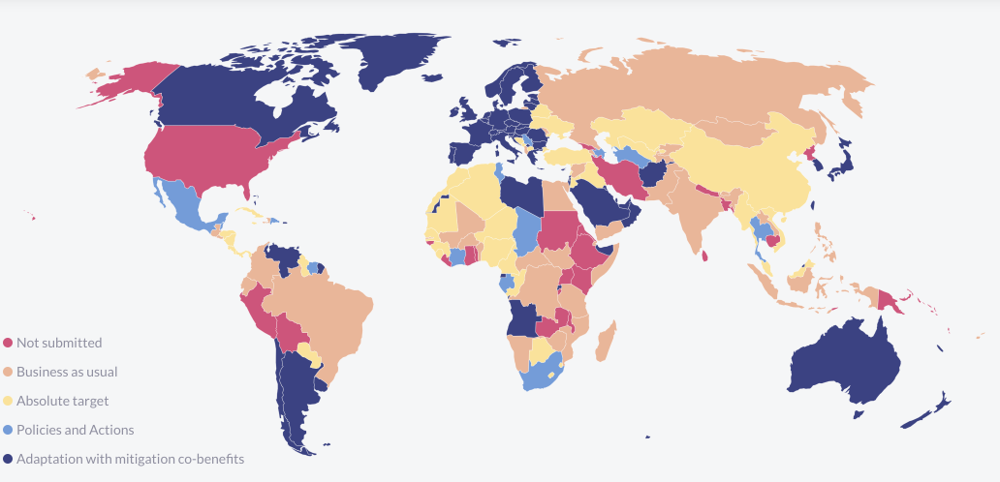

- [Accordion](https://github.com/nkbt/react-collapse)

    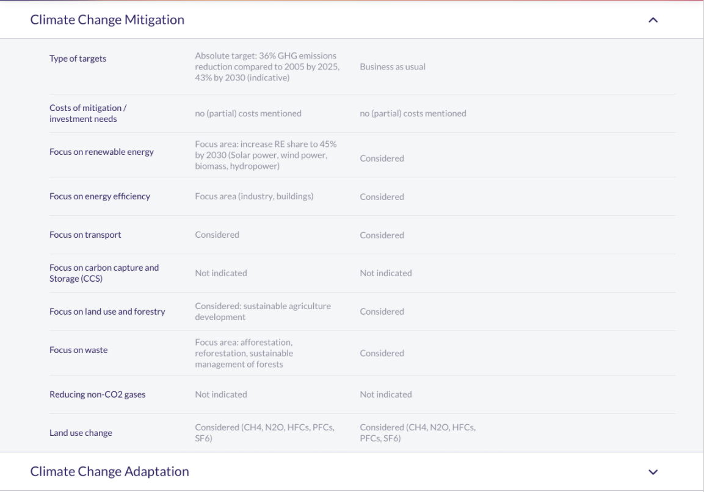

- TileGrid

    

- SDG list

    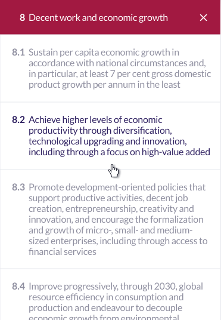

- Card

    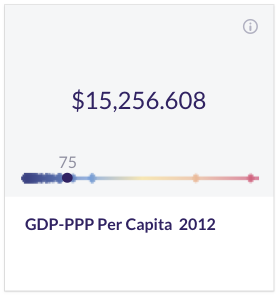

- [Table](https://github.com/bvaughn/react-virtualized)

    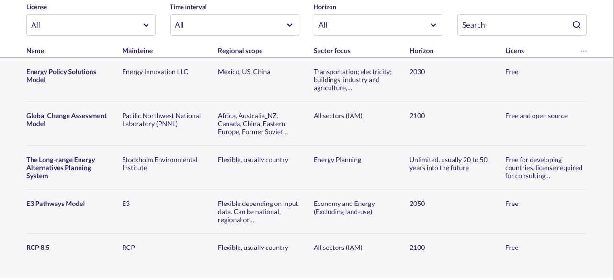